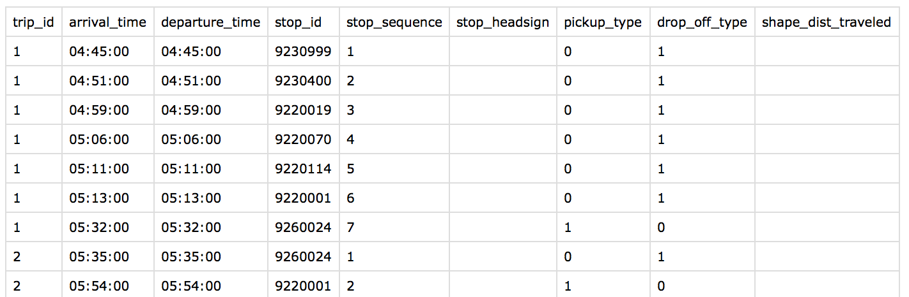
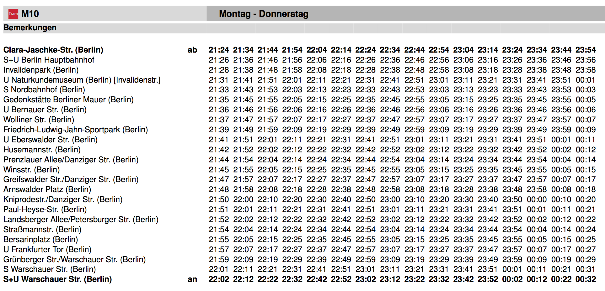

## Using Small Data in the Client
## instead of Big Data in the Cloud

by Anton Dubrau (@ant6n)

Transit App

---

# Transit App


---
# Transit App


<!--
---
## Transit App
-->

---

## Normal Approach

App is a thin client for a web service

<pre>

                       &lt;--- what's nearby? ----
              [server]                           [Transit App]
                        --- nearby schedule ---&gt;
</pre>

---
## Our Approach

store as much data as possible on the device

<pre>
                      
              [server]  --- full schedule ---&gt;  [Transit App]
                                           Now I know what's nearby!
</pre>


---

### Transit App Downloads Complete Schedules on First Load

---

# Advantage

- Better user experience
  - Much faster: 150ms to load data vs up to 5000ms
  - App works while offline
- Less load on our servers
  - Millions of sessions 'served' from one server


---

##Problem:
##Schedules are Big

- Schedule Sizes:
   - Berlin (VBB): 26MB
   - Montreal (STM): 44MB

---
### We Use Binary Files and Compression

- Berlin (VBB)
   - Original: 26MB (download in 17 min)
   - Compressed: 2MB (download in 80 sec)

- Montreal (STM)
   - Original: 44MB (download in 29 min)
   - Compressed: 490KB (download in 20 sec)

(assuming 3G speed of 200kbit/s)

---

### How is Transit Data Usually Stored?


---

### GTFS!

- General Transit Feed Specification
- Developed by Google and Trimet (Portland)
- A `*.zip` file containing `*.csv` files


---
### VBB.zip
<pre>

                   (26MB *.zip, 250MB uncompressed)
 
   stoptimes.txt  |  trips.txt  |   stops.txt  |  routes.txt  | ..
      219MB       |    23MB     |     960KB    |    216KB     |

</pre>

---
### VBB.zip
<pre>

                  (26MB *.zip, 250MB uncompressed)

  'numerical' data  |              'structured' data
 -------------------|----------------------------------------------
    stoptimes.txt   |  trips.txt  |   stops.txt  |  routes.txt  | ..
       219MB        |    23MB     |     960KB    |    216KB     |

</pre>

---
### "Numerical" Data
### `stoptimes.txt`


---
### "Numerical" Data
### As matrices



---
### "Numerical" Data
- `stoptimes.txt`: 219MB
- binary packed matrices: 10MB
- our compression: 500KB

---
### VBB.zip
<pre>

  'numerical' data  |              'structured' data
 -------------------|----------------------------------------------
    stoptimes.txt   |  trips.txt  |   stops.txt  |  routes.txt  | ..
       219MB        |    23MB     |     960KB    |    216KB     |
 --------------------------------------------------------------
    compressed:     |
       500KB        |                     ???
</pre>
---
## how Can we store the structured data?
---
## Let's consider the Stops only


---
## JSON
```
import json

def packStopsJson(stops):
    stopsArray = [
        {
		    'name': stop['name'],
			'lat':  stop['lat'],
			'lng':  stop['lng'],
			'code': stop['code'],
			'isStation': stop['isStation'],
			'serverpatternId': stop['servicePatternId']
		}
		for stop in stops]
	return json.dumps(stopsArray)
```

---
##JSON

```json
[
  {
    "code": "",
	"name": "Wiebestr. / Huttenstr.",
	"servicePatternId": 0,
	"lat": 52.528318,
	"lng": 13.32026,
	"isStation": false
  },
  {
    "code": "",
	"name": "Reuchlinstr.",
	"servicePatternId": 1,
	"lat": 52.527903,
	"lng": 13.323637,
	"isStation": false
  },
  {
    "code": "",
    ...
```
size: 2,110,204 bytes

---
## JSON:
- good:
  - easy to use
  - human readable
  - self-contained
- bad:
  - big files
  - parsing is slow

<!-- in a way great for development, rapid proto-typing -->

---
## Messagepack
- "It's like JSON. but fast and small."

---
## Messagepack

- use as drop in replacement for json, just in binary

```
import msgpack
def packStopsMsgpack(stops):
  stopsArray = [
    {
	  'name': stop['name'],
	  'lat':  stop['lat'],
	  'lng':  stop['lng'],
	  'code': stop['code'],
	  'isStation': stop['isStation'],
	  'servicePatternId': stop['servicePatternId']
    }
	for stop in stops]
  return msgpack.packb(stopsArray)
```

---
## Messagepack
- But we still store all the keys, what a waste
- We have a fixed format & don't need this metadata

<pre>
              \xdc1\xa8\x86\xa4
              name\xb6Wiebestr. / Huttenstr.\xa3
              lat\xcb@JC\x9f\xec\x99\xf1\xae\xa3
              lng\xcb@*\xa3\xf9\x1edo\x15\xa4
              code\xa0\xa9isStation\xc2\xb0
              servicePatternId\x00\x86\xa4
              name\xacReuchlinstr.\xa3
              lat\xcb@JC\x92ST:\xeb\xa3
              lng\xcb@*\xa5\xb3\xbf\xb5\x8d\x15\xa4
              code\xa0\xa9isStation\xc2\xb0
              ...
</pre>
size: 1,158,995 bytes
---

## Messagepack
use a custom serialization format:

```
import msgpack

def msgpackStop(stop, buf):
  stopCode = int(stop['code'] or 0)
  buf.write(msgpack.packb(stop['name']))
  buf.write(msgpack.packb(stop['lat']))
  buf.write(msgpack.packb(stop['lng']))
  buf.write(msgpack.packb(stopCode))
  buf.write(msgpack.packb(stop['isStation']))
  buf.write(msgpack.packb(stop['servicePatternId']))

def msgpackStops(stops, buf):
  buf.write(msgpack.packb(len(stops)))
  for stop in stops:
    msgpackStop(stop, buf)
```

---
## Messagepack
<pre>
\xb6Wiebestr. / Huttenstr.\xcb@JC\x9f\xec\x99\xf1\xae\xcb@*\xa3
\xf9\x1edo\x15\x00\xc2\x00\xacReuchlinstr.\xcb@JC\x92ST:\xeb\xcb
@*\xa5\xb3\xbf\xb5\x8d\x15\x00\xc2\x01\xaaNeues Ufer\xcb@JC\xb9
\xa5\xa8\x9b\x95\xcb@...
</pre>
size: 574,240 bytes

---
## Messagepack

- messagepack uses streams to store data
- every value is stored such that first byte identifies its type
- common values are diretly encoded using that byte

<pre>
[b6] "Wiebestr. / Huttenstr."   -  fixstring len 22 (name)
[cb] [40 4a 43 9f ec 99 f1 ae]  -  float 64 (lat)
[cb] [40 2a a3 f9 1e 64 6f 15]  -  float 64 (lng)
[00]                            -  integer 0 (stop code)
[c2]                            -  boolean false (is-station)
[00]                            -  integer 0 (service pattern id)
</pre>
---
## Messagepack

- good:
  - easy to use
  - somewhat self-contained (typed)
  - compact representation
  - great for small messages
- bad:
  - files still need to be parsed
      - packing and parsing need to be done in the same order
  - not really suitable for large structured data

---
## Cap'n Proto


---
## Cap'n Proto
- By the people who made Protocol Buffers
- Interchange format _and_ an in-memory representation
- Parsing is unnecessary, just copy the data to memory
- Data is arranged similar to C-structs
- Uses pointers, which are stored as offsets

---
### Cap'n Proto is like C-Structs
---
## Schemas!
---
stops.capnp

```
@0xc4accc237846735d; # unique file id generated by 'capnp id'

struct Stop {
    name @0 : Text;
	lat  @1 : Float64;
	lng  @2 : Float64;
	code @3 : UInt32;
	servicePatternId @4 : UInt32;
	isStation @5 : Bool;
}

struct Stops {
    stops @0 : List(Stop);
}
```

- 'capnp' generates libraries to read/write files
- in python, we can use the schema directly

---
### Cap'n Proto

```python
import capnp
import stops_capnp # import stops schema

def protoPackStop(stop):
	stop = stops_capnp.Stop.new_message(
	     name = stop['name'].encode('utf-8'),
		 lat = stop['lat'],
		 lng = stop['lng'],
		 code = int(stop['code'] or 0),
		 isStation = stop['isStation'],
		 servicePatternId = stop['servicePatternId'],
	)
	return stop

def protoPackStops(stops):
    stopObjects = [protoPackStop(stop) for stop in stops]
	result = stops_capnp.Stops.new_message(stops = stopObjects)
	return result

def writeStops(stops, f):
    f.write(protoPackStops(stops))
```

---
### Cap'n Proto

<pre>
\x02\x00\x00\x00\x02\x00\x00\x00J\xf8\x00\x00\x1b\xd0\x00
\x00\x00\x00\x00\x00\x00\x00\x01\x00\x02\x00\x00\x00\x01
\x00\x00\x00\x01\x00\x00\x00G\xc2\x07\x00\xa0\xc6\x00
\x00\x04\x00\x01\x00\xae\xf1\x99\xec\x9fCJ@\x15od\x1e
\xf9\xa3*@\x00\x00\x00\x00\x00\x00\x00\x00\x00\x00\x00

...

\x00\xba\x00\x00\x00Kostrzyn (PL), Bahnhof\x00\x00\x01\x00\x00
\x00r\x00\x00\x00Krajnik Dolny\x00\x00\x00\x01\x00\x00\x00\xc2
\x00\x00\x00Krajnik Dolny, Am Markt\x00\x01\x00\x00\x00\xd2\x00
\x00\x00Senftenberg, Puschkinstr.\x00\x00\x00\x00\x00\x00\x00

</pre>


size: 934,728 bytes

(but a lot of these values are 0)
---
### Cap'n Proto Encoding
- 64 Bit header for every struct
- 64 Bit for every pointer, which are stored as relative offsets
- encoding includes features like guarding against attacks
- padding bits are optimized
- overall encoding is a tree


---
### Flat Buffers

- developed by Google to store assets for games
- a bit more bare-bones than Captain-proto
- uses struct-like representation and schemas
---
### BUT
- I don't like schemas
- Too much data wasted in pointers
- I want more control over my bits

---
### Why can't I just use actual C-Structs?

---
### You can!
### Use Python's 'struct' module
the struct module be used to interpret strings as c structs
---
### Python's 'struct' module
```
>>> import struct
>>> struct.pack('I', 0x01020304) + struct.pack('b', 7) + struct.pack('c', '!')
'\x04\x03\x02\x01\x07!'

```

---
### Namedstruct
- We developed this helper module on top of structs
- It's schema-less, types are specified when creating data

---
### Namedstruct
```
import namedstruct

def packStop(stop):
    return (
        namedstruct.Struct("Stop")
        .addString('name', stop['name'], referenceBitWidth=8)
		.addInt32 ('lat', int(round(stop['lat']*1e7)))
		.addInt32 ('lng', int(round(stop['lng']*1e7)))
		.addUInt32('code', int(stop['code'] or 0))
		.addUInt32('servicePatternId', stop['servicePatternId'])
		.addUInt8 ('isStation', stop['isStation'])
	)
def packStops(stops):
    stopObjects = [packStop(stop) for stop in stops])
	result = namedstruct.Struct("Stops")
	stopsObject.addArray("stops", stopObjects)
	return stopsObject
```
---
### Namedstruct
```python
>>> data = packStops(stops)
>>> print data.pretty()
```
<pre>
struct Stops {
    00: ref32->StopRefArray stops=->[->struct Stop {
    00: ref8->char[] name=->u'Wiebestr. / Huttenstr.'
    01: uint8_t      isStation=False
    02: int8_t       paddingByte0=0
    03: int8_t       paddingByte1=0
    04: int32_t      lat=525283180
    08: int32_t      lng=133202600
    12: uint32_t     code=0
    16: uint32_t     servicePatternId=0
}, ->struct Stop {
    00: ref8->char[] name=->u'Reuchlinstr.'
    01: uint8_t      isStation=False
    02: int8_t       paddingByte0=0
    03: int8_t       paddingByte1=0
    04: int32_t      lat=525279030
    08: int32_t      lng=133236370
    12: uint32_t     code=0
    16: uint32_t     servicePatternId=1
},...]
}
</pre>

---
```python
>>> data = packStops(stops)
>>> print namedstruct.generateHeader(data)
```
<pre>
// *** forward declarations ******************
struct Stop;
struct StopRefArray;
struct Stops;

// *** type declarations *********************
typedef struct __attribute__((packed)) Stop {
    uint8_t  nameByteOffset;
	uint8_t  isStation;
	int8_t   paddingByte0;
	int8_t   paddingByte1;
	int32_t  lat;
	int32_t  lng;
	uint32_t code;
	uint32_t servicePatternId;

    inline char* getName() const {
	    return (char*)(uintptr_t(this)+this->nameByteOffset);
	}
} Stop;

typedef struct __attribute__((packed)) StopRefArray {
    int32_t elementByteOffsets[];
	
	/** Returns Stop-pointer to the element at the given index.
	*  If the element at the given index is null/void, then the result is undefined. */
	inline Stop* get(const int index) const {
	    return (Stop*)(uintptr_t(this)+this->elementByteOffsets[index]);
	}
} StopRefArray;


typedef struct __attribute__((packed)) Stops {
int32_t stopsByteOffset;

/** Returns StopRefArray-pointer to member stops.
*  If stops is null/void then the result is undefined. */
inline StopRefArray* getStops() const {
return (StopRefArray*)(uintptr_t(this)+this->stopsByteOffset);
}
} Stops;


#endif /* defined(__STOPS__) */


---
</pre>
### Namedstruct
```python
>>> data = packStops(stops)
>>> print namedstruct.pack(data)
```
<pre>
\x04\x00\x00\x00\xa0\xc6\x00\x00\xcc\xc6\x00\x00
\xf0\xc6\x00\x00\x10\xc7\x00\x008\xc7\x00\x00\\\
xc7\x00\x00|\xc7\x00\x00\xa0\xc7\x00\x00\xc4\xc7
\x00\x00\xec\xc7\x00\x00 \xc8\x00\x00L\xc8\x00
\x00t\xc8\x00\x00\xa0\xc8\x00\x00\xc8\xc8\x00\x00
\xe8\xc8\x00\x00\x0c\xc9\x00\x000\xc9\x00\x00T\xc9
\x00\x00|\xc9\x00\x00\xac\xc9\x00\x00\xdc\xc9\x00
\x00\xfc\xc9\x00\x000\xca\x00\x00T\xca\x00\x00t
...
</pre>

size: 603,936 bytes
---
### Namedstruct
- Further developments:
  - bitfields and bitfield arrays reduce size
  - In the end compressed names using gzip inside the file
  - total final size of stops:
      - 100KB of numbers
      - 100KB of compressed strings

---
  - total final size of stops:
      - 100KB of numbers
      - 100KB of compressed strings
  - Json: 2MB
  - MessagePack: 600K
  - CaptainProto: 900K

---
### Namedstruct
- memory/file represenation is the same
  - like Cap'n Proto /Flat Buffers
- representation is compact
- there is no separate schema, it is implied by the code
  - reader-library (C++) directly generated from objects

---
### Lack Of Schema becomes a liability
- we need a transit feed that exhibits _all_ possible fields
- this is done as part of unit/end-to-end testing
- the scheme is implied across the test suite and the code
- in the end it would be easier to maintain a schema
   - maybe declaring types is not such a bad idea

---
### Overall, the small data on the device was a success!
- small files on device
   - improve performance
   - improve user-experience
   - reduce server load

---

## Using Small Data in the Client
## instead of Big Data in the Cloud

by Anton Dubrau (@ant6n)

Transit App
